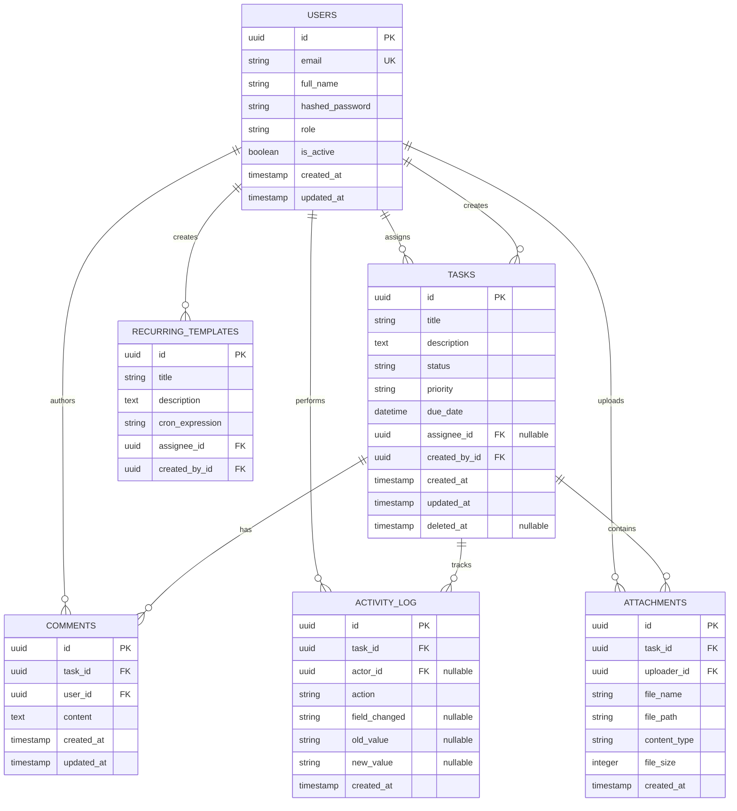

# Detailed Project Report (DPR)
**Project Name:** Smart Task Manager

## 1. Problem Statement
Modern teams require task management tools that go beyond simple CRUD operations. Many existing solutions either lack custom automation pipelines or do not integrate Artificial Intelligence natively for task breakdown and workload optimization. The challenge is to build a highly scalable, full-stack application that seamlessly integrates event-driven automations (via n8n) and native AI orchestration while maintaining strict role-based access control and high security standards.

## 2. Objectives
- **Build a Decoupled Full-Stack App:** Develop a robust backend (FastAPI) and a responsive frontend (React/Vite).
- **Implement Custom Automations:** Use n8n to handle scheduled polling (cron) and webhook-driven event notifications.
- **Integrate Native AI:** Provide an AI chatbot interface to assist users with task creation, prioritization, and workflow summarization.
- **Ensure Enterprise Security:** Enforce JWT authentication, granular Role-Based Access Control (RBAC), and robust rate limiting.

## 3. Functional Requirements
- **Authentication & RBAC:** User registration and login. Roles include `Manager` (full access) and `Member` (scoped access to assigned/created tasks).
- **Task Management:** Create, Read, Update, and Soft-Delete (CRUD) tasks with statuses (To Do, In Progress, Completed) and priorities (Low, Medium, High).
- **Task Extras:** Native support for rich interactive features inside tasks:
  - File Attachments (Upload & Download).
  - Comment threads.
  - Immutable Activity Logging for tracking field changes.
- **Dashboard & Analytics:** Real-time metrics showing total tasks, completion rates, overdue tasks, and individual user workloads.
- **Automation:** Email notifications for newly assigned tasks, recurring template generation, and impending due dates.
- **AI Chatbot:** Conversational Agentic interface for interacting with the platform.

## 4. System Architecture
The application employs a containerized, decoupled microservices architecture:
- **Client Layer:** A React SPA served via Vite.
- **API Gateway/Service Layer:** FastAPI running asynchronously via Uvicorn. Acts as the single source of truth.
- **Data Layer:** PostgreSQL (primary data store) and Redis (session caching / rate limiting).
- **Automation Engine:** An isolated n8n Docker container that communicates with the API via REST endpoints and webhooks.
- **AI Layer:** External integration with Groq (Llama-3.3-70b-versatile) via the `litellm` wrapper.

## 5. Technology Stack
- **Frontend:** React 18, Vite, TailwindCSS, Axios, date-fns, Lucide React (Icons).
- **Backend:** Python 3.12, FastAPI, SQLAlchemy 2.0 (Async), Pydantic v2, Alembic, slowapi, passlib, litellm.
- **Database & Cache:** PostgreSQL 15, Redis 7.
- **Automation:** n8n (Node-based Workflow Automation).
- **Infrastructure:** Docker & Docker Compose.

## 6. Database Design (ER Diagram)

## 7. API Design
The RESTful API is designed with explicit routing and strict Pydantic validation:
- **Auth (`/auth`)**: `/login` (OAuth2 form data), `/register`, `/me`, `/users`.
- **Tasks (`/api/v1/tasks`)**: CRUD endpoints. Includes `GET /tasks/due-soon` specifically for n8n cron polling.
- **Task Extras (`/api/v1/tasks/{id}`)**: `/comments`, `/activity`, `/attachments`.
- **Dashboard (`/api/v1/dashboard`)**: `/summary` (calculates aggregate metrics).
- **AI (`/api/v1/ai`)**: `/chat` (handles conversational agent requests).
- **Recurring (`/api/v1/recurring`)**: `/generate` (called by n8n to spawn tasks).

## 8. Automation Workflow
Four core workflows are orchestrated via n8n:
1. **Assignment & Completion Notifications:** Event-driven. The backend fires a webhook to n8n when a task's status or assignee changes. n8n routes the event and sends contextual Gmail notifications.
2. **Due Date Reminders:** Time-driven (Cron `0 8 * * *`). n8n pulls `/tasks/due-soon` and emails assignees.
3. **Overdue Escalations:** Time-driven (Cron `0 9 * * *`). n8n pulls `/tasks/overdue` and emails assignees demanding action.
4. **Recurring Tasks:** Time-driven (Cron `0 0 * * *`). n8n commands the backend `/recurring/generate` endpoint to spawn fresh instances of template tasks.

## 9. AI Features
- **Agentic Tool Calling:** The AI doesn't just answer questions; it acts on behalf of the user. We defined strict JSON schemas for tools like `create_task`. When a user types *"Create a high priority task for Alice"*, the LLM calls the tool, FastAPI executes the DB insert, and the LLM confirms creation.
- **Workload Summarization:** Users can ask for a dashboard summary. The LLM aggregates database metrics (using the `get_dashboard_summary` tool) and returns a formatted markdown report of their workload.

## 10. Security Considerations
- **Authentication:** Stateless JWT access and refresh tokens.
- **Passwords:** Hashed via `bcrypt` before storage.
- **Rate Limiting:** `slowapi` enforces strict rate limits (e.g., `5/minute` on `/login`) using client IP addresses to mitigate brute-force attacks.
- **Injection Protection:** SQLAlchemy parameterized queries inherently protect against SQL injection.
- **Data Scoping:** The Service layer dynamically appends SQL filters based on the JWT `role` claim. Members cannot query or update tasks that do not belong to them.
- **Internal System Auth:** To allow n8n to hit the API without expiring JWTs, we implemented an `X-API-Key` bypass. If the header matches a secure shared secret, the API injects an in-memory "System User" to authorize the request safely.

## 11. Future Enhancements
- **WebSockets:** Upgrading the Comments UI to use WebSockets for live, real-time collaboration.
- **Advanced RAG:** Vectorizing task descriptions and comments to allow the AI to answer deep historical context questions (e.g., *"Why did we delay the marketing launch last month?"*).
- **Multi-Tenant SaaS:** Isolating workspaces to allow multiple companies to use the platform independently.

## 12. Setup & Deployment Instructions
*(Full instructions are detailed in the `README.md`)*
1. Configure the `.env` file (Database credentials, JWT secret, n8n shared secret, Groq API key).
2. Run `docker compose up -d --build`.
3. Import the 4 JSON automation templates into the n8n UI at `http://localhost:5678`.
4. Access the application at `http://localhost:5173`.
