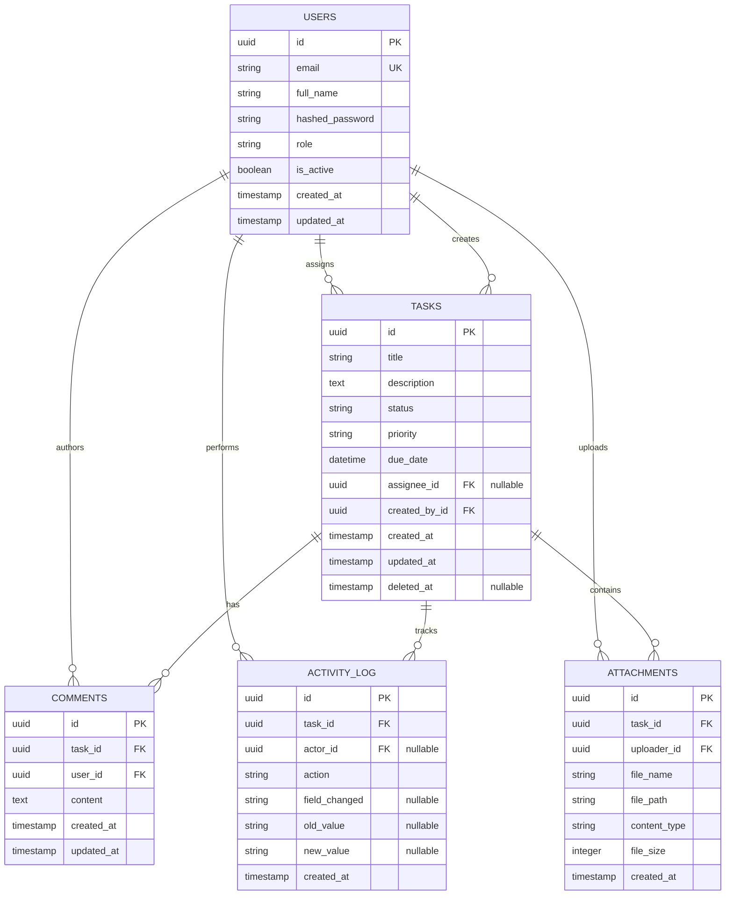

# Entity Relationship Diagram (ERD)

The following diagram illustrates the relational structure of the PostgreSQL database backing the Smart Task Manager.

```mermaid
erDiagram
    USERS {
        uuid id PK
        string email UK
        string full_name
        string hashed_password
        string role
        boolean is_active
        timestamp created_at
        timestamp updated_at
    }

    TASKS {
        uuid id PK
        string title
        text description
        string status
        string priority
        datetime due_date
        uuid assignee_id FK "nullable"
        uuid created_by_id FK
        timestamp created_at
        timestamp updated_at
        timestamp deleted_at "nullable"
    }

    COMMENTS {
        uuid id PK
        uuid task_id FK
        uuid user_id FK
        text content
        timestamp created_at
        timestamp updated_at
    }

    ACTIVITY_LOG {
        uuid id PK
        uuid task_id FK
        uuid actor_id FK "nullable"
        string action
        string field_changed "nullable"
        string old_value "nullable"
        string new_value "nullable"
        timestamp created_at
    }

    ATTACHMENTS {
        uuid id PK
        uuid task_id FK
        uuid uploader_id FK
        string file_name
        string file_path
        string content_type
        integer file_size
        timestamp created_at
    }

    USERS ||--o{ TASKS : "assigns"
    USERS ||--o{ TASKS : "creates"
    USERS ||--o{ COMMENTS : "authors"
    USERS ||--o{ ACTIVITY_LOG : "performs"
    USERS ||--o{ ATTACHMENTS : "uploads"

    TASKS ||--o{ COMMENTS : "has"
    TASKS ||--o{ ACTIVITY_LOG : "tracks"
    TASKS ||--o{ ATTACHMENTS : "contains"
```
